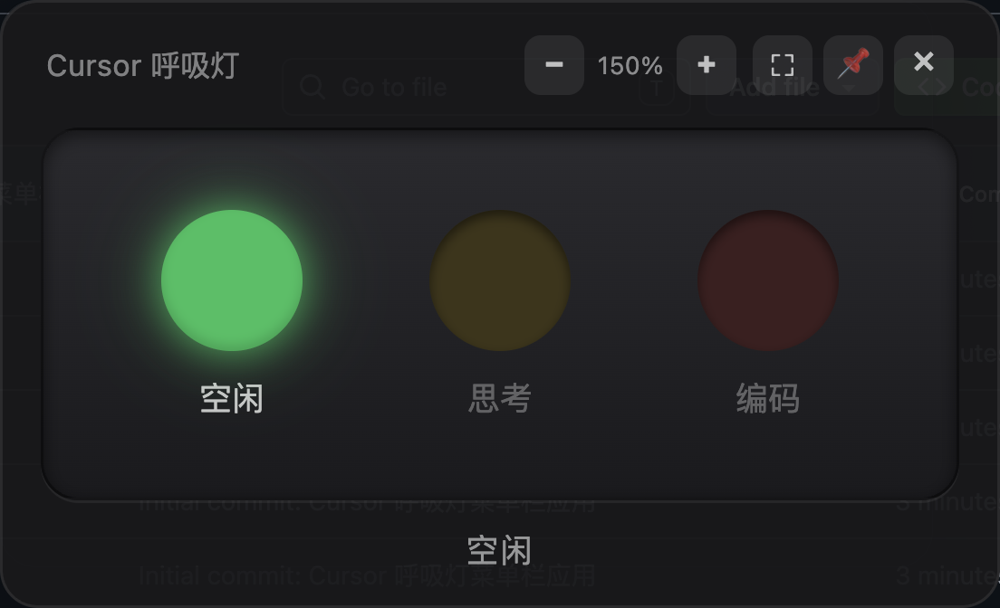

# Cursor 呼吸灯

在 macOS 菜单栏以**经典红绿灯**样式展示 Cursor Agent 的工作状态：通过 Cursor 用户级 Hooks 监听 Agent 事件，由本地菜单栏应用实时显示绿 / 黄 / 红三灯。



| 灯色 | 状态 | 含义 |
|------|------|------|
| 绿灯 | `idle` | Agent 未在工作 |
| 黄灯 | `thinking` | Agent 正在思考、读文件、执行非写文件类工具 |
| 红灯 | `coding` | Agent 正在写 / 改代码 |


## 环境要求

### 操作系统

| 项目 | 要求 |
|------|------|
| 系统 | **macOS**（菜单栏 Tray 与窗口行为按 macOS 实现） |
| 架构 | Apple Silicon / Intel 均可 |

### 运行时与工具

| 依赖 | 版本 / 说明 |
|------|-------------|
| **Node.js** | **22+**（Hook 脚本使用 `node --experimental-strip-types` 直接运行 TypeScript） |
| **npm** | 9+（随 Node 安装；项目使用 npm workspaces） |
| **Cursor** | 支持 [Hooks](https://cursor.com/docs/hooks) 的版本（Agent / Composer 场景） |

可选：

| 依赖 | 说明 |
|------|------|
| Bun | 非必须；Hook 安装脚本仅使用 Node |

### 网络（首次安装）

安装依赖时需下载 **Electron** 二进制。若官方源较慢，可使用国内镜像：

```bash
ELECTRON_MIRROR=https://npmmirror.com/mirrors/electron/ npm install
```

### 端口

菜单栏应用启动后会在本机监听 **`127.0.0.1:39281`**，供 Hook 脚本 POST 状态。请确保该端口未被占用。

## 架构

```text
Cursor Agent
    ↓ 触发用户级 Hooks（~/.cursor/hooks.json）
breathing-light-update.sh → update-state.ts
    ↓ 写入 ~/.cursor/breathing-light/state.json
    ↓ POST http://127.0.0.1:39281/state
Electron 菜单栏应用（Tray + 弹窗 UI）
```

- **Hook 层**：全局生效，对所有 Cursor 工作区中的 Agent 活动生效（用户级配置，非项目级）。
- **桥接层**：Hook 必须快速返回（<100ms），失败时仍写 state 文件，不阻塞 Agent。
- **展示层**：菜单栏为横排三灯小图标；点击弹出可拖拽、可固定、可缩放、可全屏的红绿灯面板。

## 快速开始

### 1. 克隆并安装依赖

```bash
cd breathing_light
npm install
```

国内网络建议：

```bash
ELECTRON_MIRROR=https://npmmirror.com/mirrors/electron/ npm install
```

### 2. 安装 Cursor Hooks（仅需一次）

```bash
npm run install-hooks
```

等价于执行 `./scripts/install-hooks.sh`。脚本会：

- 复制 `hooks/update-state.ts` → `~/.cursor/hooks/breathing-light-update.ts`
- 创建 `~/.cursor/hooks/breathing-light-update.sh`（Node 包装器）
- **合并**（不覆盖）现有 `~/.cursor/hooks.json`，注册以下事件：

  `beforeSubmitPrompt`、`sessionStart`、`preToolUse`、`postToolUse`、`postToolUseFailure`、`afterFileEdit`、`afterAgentThought`、`stop`、`sessionEnd`

**安装后请重启 Cursor**，在设置中确认 Hooks 已加载。

### 3. 构建（生产运行前建议执行）

```bash
npm run build
```

产物位于 `apps/menubar/out/`（main / preload / renderer）。

### 4. 启动菜单栏应用

**推荐（生产 / 日常使用）**——在系统终端（Terminal.app）中执行：

```bash
cd apps/menubar
npm run start
```

成功时终端会输出类似：

```text
[breathing-light] 已启动 — 状态: idle，菜单栏右上角找圆点图标，HTTP :39281
```

在屏幕**右上角菜单栏**查找横排三灯小图标（若图标较多，点 `>>` 展开）。

**开发模式**（热更新 UI，需保持终端运行）：

```bash
# 在项目根目录
npm run menubar
```

> **注意**：在 Cursor 内置终端中，环境变量 `ELECTRON_RUN_AS_NODE` 可能导致 Electron 无法正常显示菜单栏。若 `npm run menubar` 无图标，请改用系统终端执行 `cd apps/menubar && npm run start`。启动脚本已使用 `env -u ELECTRON_RUN_AS_NODE` 规避该问题。

### 5. 验证

1. 确认菜单栏出现三灯图标（当前状态对应灯亮起）。
2. 在 Cursor 中向 Agent 发送消息 → 黄灯亮。
3. 让 Agent 执行 `Write` / `StrReplace` 等写文件操作 → 红灯亮。
4. Agent 完成一轮（`stop`）→ 绿灯亮。

手动测试 Hook 与 HTTP：

```bash
echo '{"hook_event_name":"beforeSubmitPrompt","conversation_id":"test"}' \
  | node --experimental-strip-types hooks/update-state.ts

curl -s http://127.0.0.1:39281/state
```

## 弹窗功能

点击菜单栏图标打开红绿灯面板：

| 功能 | 操作 |
|------|------|
| 拖拽移动 | 按住顶部「Cursor 呼吸灯」标题栏 |
| 固定到屏幕 | 点击 📌；固定后点击外部或菜单栏图标不会关闭 |
| 关闭 | 点击 ×；未固定时也可再次点击菜单栏图标关闭 |
| 整体缩放 | 工具栏 `−` / `+`（60%～200%），保存至 preferences |
| 全屏 | 点击 ⛶ 铺满当前显示器工作区，再点退出 |

## Hook 事件与状态映射

| Hook 事件 | 状态 |
|-----------|------|
| `beforeSubmitPrompt`、`sessionStart`、`afterAgentThought`、`postToolUse`、`postToolUseFailure` | 黄灯 `thinking` |
| `preToolUse`（工具为 Write / StrReplace / EditNotebook / Delete 等）、`afterFileEdit` | 红灯 `coding` |
| `stop`、`sessionEnd` | 绿灯 `idle` |

## 本地数据文件

| 路径 | 说明 |
|------|------|
| `~/.cursor/hooks.json` | Cursor Hooks 配置（由安装脚本合并写入） |
| `~/.cursor/hooks/breathing-light-update.ts` | 已部署的 Hook 脚本 |
| `~/.cursor/breathing-light/state.json` | 最近一次 Agent 状态 |
| `~/.cursor/breathing-light/preferences.json` | 缩放比例、固定等 UI 偏好 |

## 项目结构

```text
breathing_light/
├── package.json              # 根 workspace
├── hooks/
│   └── update-state.ts       # Cursor Hook：解析事件 → 写文件 + POST
├── scripts/
│   └── install-hooks.sh      # 部署到 ~/.cursor/
├── shared/
│   └── types.ts              # ActivityState 等共享类型
└── apps/menubar/             # Electron + React 菜单栏应用
    ├── package.json
    ├── electron.vite.config.ts
    └── src/
        ├── main/index.ts     # Tray、HTTP :39281、窗口管理
        ├── preload/index.ts
        └── renderer/         # 红绿灯 UI（App.tsx、breathing.css）
```

## 常用命令

| 命令 | 说明 |
|------|------|
| `npm install` | 安装依赖 |
| `npm run install-hooks` | 安装 / 更新 Cursor Hooks |
| `npm run build` | 构建 menubar 应用 |
| `npm run menubar` | 开发模式启动（electron-vite dev） |
| `cd apps/menubar && npm run start` | 生产模式启动（需先 build） |
| `cd apps/menubar && npm run dist` | 构建并打包为 macOS `.dmg`（见下文） |

## 打包为 DMG

菜单栏应用使用 [electron-builder](https://www.electron.build/) 生成 macOS 安装镜像，配置见 `apps/menubar/package.json` 中的 `build` 字段。

### 前置条件

- 在 **macOS** 上执行（无法在 Linux / Windows 上打出可用的 `.dmg`）
- 已完成 [快速开始](#快速开始) 中的依赖安装（`npm install`）
- 本机已安装 **Xcode Command Line Tools**（首次打包时 electron-builder 可能调用系统工具）：

```bash
xcode-select --install
```

### 打包步骤

1. 在项目根目录安装依赖（若尚未安装）：

```bash
npm install
```

国内网络可加上 Electron 镜像：

```bash
ELECTRON_MIRROR=https://npmmirror.com/mirrors/electron/ npm install
```

2. 进入菜单栏应用目录并执行打包脚本（会先 `electron-vite build`，再生成 DMG）：

```bash
cd apps/menubar
npm run dist
```

或在项目根目录通过 workspace 执行：

```bash
npm run dist -w @breathing-light/menubar
```

3. 等待命令结束。成功时终端会输出 electron-builder 的构建日志，产物位于：

```text
apps/menubar/release/
├── Cursor_Breathing_Light-<版本号>.dmg    # 可分发的安装镜像
└── mac-arm64/ 或 mac/                     # 未封装的 .app（调试用）
    └── Cursor_Breathing_Light.app
```

当前 `package.json` 中 `version` 为 `1.0.0` 时，DMG 文件名一般为 **`Cursor_Breathing_Light-1.0.0.dmg`**。修改版本号后重新 `npm run dist` 即可得到新文件名。

### 安装与分发说明

1. 将 `release/` 目录下的 `.dmg` 拷贝到目标 Mac，双击打开。
2. 将窗口中的 **`Cursor_Breathing_Light.app`** 拖入「应用程序」文件夹。
3. 从启动台或「应用程序」中打开一次，确认菜单栏出现三灯图标。

**重要**：`.dmg` 仅包含菜单栏应用，**不会**自动安装 Cursor Hooks。接收方仍需按 [快速开始 · 安装 Cursor Hooks](#2-安装-cursor-hooks仅需一次) 或 [新电脑安装说明](docs/new-machine-setup.md) 配置 `~/.cursor/hooks.json`，否则灯不会随 Agent 状态变化。

### 常见问题

| 现象 | 处理 |
|------|------|
| `npm run dist` 报错找不到 `electron-builder` | 在项目根执行 `npm install`，确保 `apps/menubar` 的 devDependencies 已安装 |
| 其他机器提示「已损坏」或无法打开 | 当前未配置 Apple 开发者签名与公证；可在目标 Mac 上对 `.app` 执行 `xattr -cr "/Applications/Cursor_Breathing_Light.app"` 后再打开，或仅在「系统设置 → 隐私与安全性」中允许 |
| 需要自定义应用名、图标、Bundle ID | 编辑 `apps/menubar/package.json` 的 `build.productName`、`build.appId` 及 `mac.icon` 等字段后重新打包 |

`release/` 目录已在 `.gitignore` 中忽略，不会提交到 Git。

## 已知局限

- **思考开始无 Hook**：仅有 `afterAgentThought`（思考结束后）；靠 `beforeSubmitPrompt` 提前切黄灯，推理过程中保持黄灯。
- **多会话**：任意 `stop` / `sessionEnd` 即回绿灯；多 Agent 并行时状态可能不准确。
- **Tab 补全**：默认不监控；可在 `hooks.json` 自行追加 `afterTabFileEdit`。
- **Cloud Agent**：用户级 Hook 不作用于 Cursor Cloud Agent。
- **菜单栏未启动时**：Hook 仍更新 `state.json`，下次启动应用会恢复显示。

## 技术栈

- **Hook**：Node.js TypeScript（`fetch` POST 本地服务）
- **菜单栏**：Electron 35 + electron-vite 3 + React 19 + TypeScript 5

---

## 附录：从零构建本项目的提示词

将以下内容作为给 AI 编码助手的完整需求说明，可在空仓库中复现本项目（macOS 菜单栏 + Cursor Hooks 全局监控）：

```markdown
请实现一个名为「Cursor 呼吸灯」的 macOS 项目，要求如下。

## 目标

监控 Cursor IDE 中 Agent 的工作状态，在 macOS 菜单栏以经典红绿灯形式展示：
- 绿灯 idle：Agent 未工作
- 黄灯 thinking：Agent 思考中、读文件、跑非写文件工具
- 红灯 coding：Agent 正在 Write / StrReplace 等写代码

## 技术方案

1. **Cursor 用户级 Hooks**（~/.cursor/hooks.json + ~/.cursor/hooks/）
   - 单脚本 hooks/update-state.ts，由 install-hooks.sh 部署为 breathing-light-update.ts
   - 使用 Node 22+ 与 `node --experimental-strip-types` 执行（提供 .sh 包装器）
   - 根据 hook_event_name 与 tool_name 映射三种状态
   - 写入 ~/.cursor/breathing-light/state.json，并 POST http://127.0.0.1:39281/state（500ms 超时，失败静默，始终 exit 0 输出 {}）
   - 注册事件：beforeSubmitPrompt, sessionStart, preToolUse, postToolUse, postToolUseFailure, afterFileEdit, afterAgentThought, stop, sessionEnd
   - 写工具集合：Write, StrReplace, EditNotebook, Delete, TabWrite

2. **Electron 菜单栏应用**（apps/menubar，electron-vite + React）
   - 主进程：Tray 图标为横排三灯位图（绿|黄|红，当前状态高亮，暗色灯罩圆角矩形）；本地 HTTP GET/POST /state 端口 39281；无边框透明弹窗
   - 弹窗 UI：横排三灯（空闲/思考/编码），仅当前灯呼吸动画；工具栏含缩放 −/+（60%～200%）、全屏 ⛶、固定 📌、关闭 ×；标题栏可拖拽；固定后不因失焦关闭；全屏铺满 workArea
   - 默认窗口约 368×224；preferences.json 持久化 scale 与 pinned
   - 启动脚本使用 env -u ELECTRON_RUN_AS_NODE；macOS 隐藏 Dock 图标
   - IPC：get-state, set-scale, toggle-fullscreen, set-pinned, hide-popup 及对应事件推送

3. **Monorepo**
   - 根 package.json workspaces: apps/*
   - 脚本：npm run menubar（dev）、npm run build、npm run install-hooks

## 状态机（简化）

- idle ← stop / sessionEnd
- thinking ← beforeSubmitPrompt, sessionStart, afterAgentThought, postToolUse, postToolUseFailure；preToolUse 非写工具
- coding ← preToolUse 写工具、afterFileEdit

## 交付

- README 含环境要求、安装 hooks、build、start、局限说明
- install-hooks.sh 合并已有 hooks.json，不覆盖其他 hook
- .gitignore 含 node_modules、out、dist

仅实现上述范围，保持 Hook 脚本极简快速，不要过度抽象。
```
