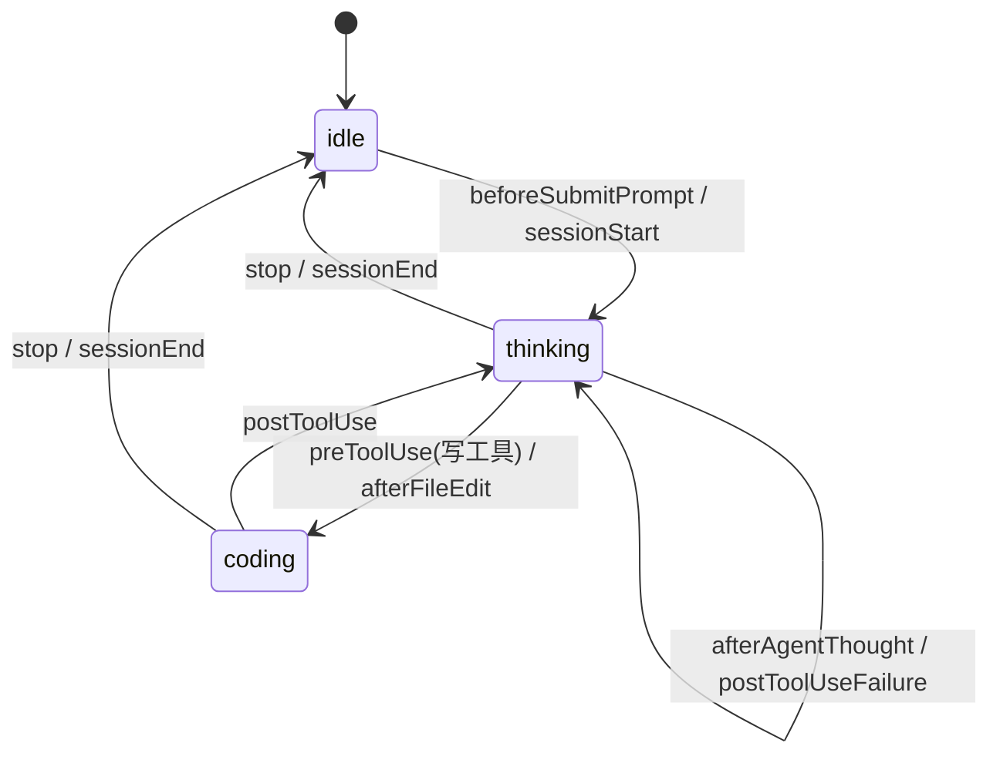

# Cursor 呼吸灯 — 实现原理

本文档从架构、数据流、状态机、各模块职责与设计取舍等角度，说明本项目的完整实现原理，便于阅读源码、二次开发或排查问题。

---

## 目录

1. [项目目标与约束](#1-项目目标与约束)
2. [总体架构](#2-总体架构)
3. [端到端数据流](#3-端到端数据流)
4. [状态模型与状态机](#4-状态模型与状态机)
5. [Hook 层：事件采集与状态推断](#5-hook-层事件采集与状态推断)
6. [桥接层：持久化与 HTTP 通知](#6-桥接层持久化与-http-通知)
7. [展示层：Electron 菜单栏应用](#7-展示层electron-菜单栏应用)
8. [进程间通信（IPC）](#8-进程间通信ipc)
9. [UI 与视觉实现](#9-ui-与视觉实现)
10. [安装与部署机制](#10-安装与部署机制)
11. [本地数据与配置](#11-本地数据与配置)
12. [可靠性、性能与设计取舍](#12-可靠性性能与设计取舍)
13. [已知局限与扩展方向](#13-已知局限与扩展方向)

---

## 1. 项目目标与约束

### 1.1 目标

在 **macOS 菜单栏** 以经典 **红绿灯（绿 / 黄 / 红）** 形式，实时反映 **Cursor Agent** 的工作阶段：

| 状态 | 枚举值 | 用户感知 |
|------|--------|----------|
| 空闲 | `idle` | Agent 未在工作 |
| 思考 | `thinking` | 推理、读文件、执行非写文件类工具 |
| 编码 | `coding` | 正在写 / 改代码 |

### 1.2 核心约束

Cursor 官方提供 **Hooks** 机制：在 Agent 生命周期的特定节点执行用户脚本。本项目的 Hook 脚本必须满足：

1. **极快返回**：官方建议 Hook 在约 **100ms** 内完成，否则会拖慢 Agent。
2. **不阻塞 Agent**：无论成功失败，都应尽快 `exit 0`，并输出合法 JSON（本项目统一输出 `{}`）。
3. **全局生效**：采用 **用户级** `~/.cursor/hooks.json`，对所有工作区中的 Agent 活动生效，而非单仓库配置。
4. **与 IDE 解耦展示**：菜单栏由独立 **Electron** 进程负责，通过本地 HTTP + 文件与 Hook 通信。

---

## 2. 总体架构

系统分为三层，通过本地文件与 loopback HTTP 解耦：

```text
┌─────────────────────────────────────────────────────────────┐
│                      Cursor IDE / Agent                      │
│   用户发消息 → 工具调用 → 写文件 → 会话结束 …                  │
└───────────────────────────┬─────────────────────────────────┘
                            │ 触发 Hooks（stdin JSON）
                            ▼
┌─────────────────────────────────────────────────────────────┐
│  Hook 层（~/.cursor/hooks/breathing-light-update.ts）        │
│  · 解析 hook_event_name / tool_name                          │
│  · resolveState() → idle | thinking | coding                 │
│  · 写 state.json + POST /state（500ms 超时，失败静默）        │
└───────────────────────────┬─────────────────────────────────┘
                            │
              ┌─────────────┴─────────────┐
              ▼                           ▼
   ~/.cursor/breathing-light/      127.0.0.1:39281
        state.json                  POST /state
              │                           │
              └─────────────┬─────────────┘
                            ▼
┌─────────────────────────────────────────────────────────────┐
│  展示层（Electron apps/menubar）                              │
│  · Tray 三灯位图（菜单栏图标）                                │
│  · HTTP Server 接收状态                                       │
│  · React 弹窗（红绿灯 + 工具栏）                              │
└─────────────────────────────────────────────────────────────┘
```

### 2.1 Monorepo 结构

| 路径 | 职责 |
|------|------|
| `hooks/update-state.ts` | Hook 源码，由安装脚本部署到 `~/.cursor/hooks/` |
| `scripts/install-hooks.sh` | 复制脚本、生成 Node 包装器、合并 `hooks.json` |
| `shared/types.ts` | 共享类型与常量（文档/参考，Hook 内联了类型） |
| `apps/menubar/` | Electron + React 菜单栏应用 |

根 `package.json` 使用 **npm workspaces**（`apps/*`），统一 `npm run build`、`npm run menubar`、`npm run install-hooks`。

---

## 3. 端到端数据流

以「用户在 Cursor 中向 Agent 发送一条消息，Agent 随后修改一个文件」为例：

```text
1. beforeSubmitPrompt
   → Hook: thinking
   → state.json 更新 + POST menubar
   → Tray 黄灯亮、弹窗黄灯呼吸

2. preToolUse (tool_name = Read)
   → Hook: thinking（非写工具）
   → 保持黄灯

3. preToolUse (tool_name = StrReplace)
   → Hook: coding
   → Tray 红灯亮

4. afterFileEdit
   → Hook: coding（巩固红灯）

5. postToolUse
   → Hook: thinking（工具结束，回到思考态）

6. stop
   → Hook: idle
   → Tray 绿灯亮
```

**关键路径延迟**：Hook 仅做内存计算、一次文件写入、一次本地 HTTP；HTTP 使用 `AbortSignal.timeout(500)`，menubar 未启动时写文件仍成功，下次启动 menubar 会从 `state.json` 恢复。

---

## 4. 状态模型与状态机

### 4.1 状态类型

```typescript
type ActivityState = 'idle' | 'thinking' | 'coding';
```

状态载荷（Hook 与 menubar 共用）：

```typescript
interface StatePayload {
  state: ActivityState;
  updated_at: number;      // Date.now()
  source: string;          // hook_event_name 或 'menubar'
  conversation_id?: string;
}
```

### 4.2 状态转换表

Hook 中 `resolveState()` 的逻辑（`hooks/update-state.ts`）：

| Hook 事件 | 结果状态 | 说明 |
|-----------|----------|------|
| `stop` | `idle` | Agent 本轮结束 |
| `sessionEnd` | `idle` | 会话结束 |
| `beforeSubmitPrompt` | `thinking` | 用户提交提示词，Agent 即将工作 |
| `sessionStart` | `thinking` | 新会话开始 |
| `afterAgentThought` | `thinking` | 一轮思考结束（见局限：无「思考开始」事件） |
| `postToolUseFailure` | `thinking` | 工具失败，仍在处理中 |
| `preToolUse` + 写工具名 | `coding` | 即将执行写操作 |
| `preToolUse` + 其他工具 | `thinking` | 读、搜索等 |
| `postToolUse` | `thinking` | 工具执行完毕 |
| `afterFileEdit` | `coding` | 文件已被编辑 |
| `afterTabFileEdit` | `coding` | Tab 补全写文件（需自行注册到 hooks.json） |
| 其他事件 | `null`（不更新） | 忽略 |

**写工具集合**（`WRITE_TOOLS`）：

- `Write`、`StrReplace`、`EditNotebook`、`Delete`、`TabWrite`

### 4.3 状态机示意



说明：本实现是 **事件驱动** 而非显式状态机类；每个 Hook 事件独立映射目标状态，**后到达的事件覆盖前者**，无历史栈。

---

## 5. Hook 层：事件采集与状态推断

### 5.1 Cursor Hooks 如何调用脚本

1. Cursor 读取用户级 `~/.cursor/hooks.json`。
2. 当 Agent 触发已注册事件时，Cursor 启动配置中的 `command`（本项目为 `./hooks/breathing-light-update.sh`）。
3. **标准输入（stdin）** 传入 JSON，包含至少 `hook_event_name`，以及可能有的 `tool_name`、`conversation_id` 等。
4. 脚本应将结果打印到 **stdout**（本项目固定 `console.log('{}')`）。

安装脚本注册的 9 个事件：

`beforeSubmitPrompt`、`sessionStart`、`preToolUse`、`postToolUse`、`postToolUseFailure`、`afterFileEdit`、`afterAgentThought`、`stop`、`sessionEnd`

### 5.2 执行方式

`breathing-light-update.sh` 包装器：

```bash
exec node --experimental-strip-types "$HOME/.cursor/hooks/breathing-light-update.ts"
```

要求 **Node.js 22+**：利用 `--experimental-strip-types` 直接运行 TypeScript，无需预编译 Hook。

### 5.3 主流程（`main()`）

1. `readStdin()`：聚合 stdin 为字符串。
2. `JSON.parse`：失败则输出 `{}` 并 `exit 0`。
3. `resolveState(input)`：若为 `null`，不更新状态。
4. 构造 `payload`，`mkdir` + `writeFile` 写入 `~/.cursor/breathing-light/state.json`。
5. `fetch(POST http://127.0.0.1:39281/state)`，**500ms 超时**；失败静默（menubar 可能未运行）。
6. 输出 `{}`，`exit 0`。
7. 顶层 `main().catch` 同样保证 exit 0，**绝不向 Cursor 抛错**。

### 5.4 为何 `postToolUse` 映射为 thinking

工具执行结束后，Agent 可能继续推理或调用下一工具，尚未到达 `stop`。若保持 `coding`，红灯会在写文件结束后仍长时间亮着，与「正在写代码」的语义不符。故 `postToolUse` 回到 `thinking`。

### 5.5 为何需要 `afterFileEdit`

部分写操作在 `preToolUse` 之后才真正落盘；`afterFileEdit` 将状态巩固为 `coding`，避免红灯过早熄灭。

---

## 6. 桥接层：持久化与 HTTP 通知

### 6.1 双通道设计

| 通道 | 路径 / 地址 | 作用 |
|------|-------------|------|
| 文件 | `~/.cursor/breathing-light/state.json` | 持久化最近一次状态；menubar 未运行时 Hook 仍可记录 |
| HTTP | `http://127.0.0.1:39281/state` | 实时推送给已运行的 menubar，更新 Tray 与弹窗 |

### 6.2 HTTP API（menubar 主进程）

由 `apps/menubar/src/main/index.ts` 中 `startHttpServer()` 实现，仅监听 **127.0.0.1**（不暴露外网）：

| 方法 | 路径 | 行为 |
|------|------|------|
| `GET` | `/state` | 返回当前内存中的 `currentState` |
| `POST` | `/state` | Body 为 `StatePayload`，调用 `broadcastState()` |
| 其他 | — | `404` |

`broadcastState()` 会：

1. 更新 `currentState`
2. 重绘 Tray 图标（`createTrayIcon`）
3. 更新 Tray tooltip
4. 若弹窗存在，向 renderer 发送 `state-update` IPC 事件

### 6.3 启动时状态恢复

`app.whenReady()` 时：

1. `loadPersistedState()` 从 `state.json` 读取
2. 若有历史状态，初始化 `currentState` 与 Tray 图标
3. 之后 HTTP POST 会覆盖为更新状态

因此：**先开 Cursor Agent、后开 menubar** 也能显示最后一次 Hook 写入的状态。

---

## 7. 展示层：Electron 菜单栏应用

技术栈：**Electron 35** + **electron-vite 3** + **React 19** + **TypeScript 5**。

### 7.1 进程模型

```text
┌──────────────── Main Process (index.ts) ────────────────┐
│  Tray · HTTP Server · BrowserWindow · ipcMain           │
└────────────────────────┬────────────────────────────────┘
                         │ contextBridge
┌────────────────────────▼────────────────────────────────┐
│  Preload (preload/index.ts)                             │
│  window.breathingLight = { getState, onStateUpdate, … } │
└────────────────────────┬────────────────────────────────┘
                         │
┌────────────────────────▼────────────────────────────────┐
│  Renderer (React App.tsx + breathing.css)                 │
│  红绿灯 UI、工具栏、订阅状态更新                           │
└─────────────────────────────────────────────────────────┘
```

- **contextIsolation: true**，**nodeIntegration: false**，符合 Electron 安全实践。
- Renderer 不直接访问 Node API，仅通过 `window.breathingLight` 调用主进程。

### 7.2 macOS 特有行为

- `app.dock?.hide()`：隐藏 Dock 图标，应用仅以菜单栏 Tray 存在。
- `skipTaskbar: true`：弹窗不出现在任务栏。
- Tray 图标由主进程 **逐像素绘制** RGBA buffer，非静态 PNG 资源。

### 7.3 Tray 图标生成算法

`createTrayIcon(state)`（44×28 逻辑像素，`scaleFactor: 2` 适配 Retina）：

1. 绘制深灰圆角矩形背景（模拟灯罩面板）。
2. 三颗灯固定位置：绿 (cx=11)、黄 (cx=22)、红 (cx=33)。
3. **当前状态**的灯使用高亮色（`#22c55e` / `#eab308` / `#ef4444`），其余为暗色（`TRAY_DIM_COLORS`）。
4. `nativeImage.createFromBuffer` 生成 `NativeImage`，`setTemplateImage(false)` 保留彩色。

状态变化时仅重绘位图并 `tray.setImage()`，无需打包多套图标文件。

### 7.4 弹窗窗口（BrowserWindow）

| 属性 | 值 / 行为 |
|------|-----------|
| `frame: false` | 无边框 |
| `transparent: true` | 透明背景，圆角面板由 CSS 绘制 |
| `alwaysOnTop: true` | 置顶；固定模式用 `floating` 级别 |
| `movable: true` | 可拖拽；用户拖动后 `popupUserPositioned = true`，不再自动贴 Tray |
| 默认尺寸 | 368×224，随 `scale` 缩放（0.6～2.0） |

**显示逻辑**（`togglePopup`）：

- 点击 Tray：若已显示且未固定 → 隐藏；若已固定 → 仅 focus；若未显示 → `showPopup()`。
- 首次创建：`createPopup()` 加载 renderer 并显示。

**定位**（`positionPopup`）：在 Tray 图标上方居中，限制在当前显示器 `workArea` 内。

### 7.5 全屏模式

- `enterFullscreen()`：保存当前 bounds，窗口铺满当前显示器 `workArea`，`alwaysOnTop` 升为 `screen-saver`。
- `exitFullscreen()`：恢复 bounds 或按 scale 重置尺寸。
- Renderer 通过 `fullscreen-update` 切换 CSS class `panel--fullscreen` 与 `html.is-fullscreen`。

### 7.6 固定（Pin）模式

- `set-pinned`：设置 `popupPinned`，`setAlwaysOnTop(pinned, 'floating')`。
- 固定后点击 Tray 不会关闭弹窗，仅聚焦。
- 偏好写入 `preferences.json`。

### 7.7 启动与环境变量

生产启动：`env -u ELECTRON_RUN_AS_NODE electron .`

在 **Cursor 内置终端** 中，`ELECTRON_RUN_AS_NODE` 可能导致 Electron 以 Node 模式运行、Tray 不显示。取消该环境变量可避免此问题。

开发模式：`electron-vite dev`，通过 `ELECTRON_RENDERER_URL` 热更新 renderer。

---

## 8. 进程间通信（IPC）

Preload 暴露的 `window.breathingLight` API：

| API | 方向 | 说明 |
|-----|------|------|
| `getState()` | Renderer → Main | 返回当前 `StatePayload` |
| `onStateUpdate(cb)` | Main → Renderer | 订阅 `state-update` |
| `getPinned` / `setPinned` | 双向 | 固定状态 |
| `onPinUpdate` | Main → Renderer | 固定状态变化 |
| `getScale` / `setScale` | 双向 | UI 缩放 0.6～2.0 |
| `onScaleUpdate` | Main → Renderer | 缩放变化 |
| `getFullscreen` / `toggleFullscreen` | 双向 | 全屏切换 |
| `onFullscreenUpdate` | Main → Renderer | 全屏状态变化 |
| `hidePopup()` | Renderer → Main | 关闭弹窗（若全屏先退出） |

主进程在 `broadcastState`、缩放、固定、全屏等操作后，主动向 renderer **push** 事件，React 用 `useEffect` 订阅并更新本地 state。

---

## 9. UI 与视觉实现

### 9.1 组件结构（`App.tsx`）

- 顶部 **toolbar**：标题栏（`-webkit-app-region: drag` 可拖拽窗口）、缩放 `−/+`、全屏、固定、关闭。
- 中部 **traffic-light**：横排三盏灯 + 标签（空闲 / 思考 / 编码）。
- 底部 **status**：当前状态文字。

仅 **当前状态** 对应灯泡添加 `bulb--on`，触发 CSS 动画 `breathe`（亮度与透明度周期变化，2.4s）。

### 9.2 样式要点（`breathing.css`）

- 面板：`rgba` 半透明背景 + `backdrop-filter: blur`。
- 熄灭灯：深色内阴影模拟未亮灯罩。
- 点亮灯：高饱和色 + 外发光 `box-shadow`。
- 全屏：`zoom: 2.8` 放大面板内容，深色全屏背景。

缩放非全屏时使用 CSS `zoom: scale` 作用于 `.panel`；主进程同步调整 `BrowserWindow` 的 width/height（`BASE_WIDTH * scale`）。

---

## 10. 安装与部署机制

`scripts/install-hooks.sh` 执行：

1. **复制** `hooks/update-state.ts` → `~/.cursor/hooks/breathing-light-update.ts`
2. **生成** `breathing-light-update.sh`（Node 包装器）
3. **合并** `~/.cursor/hooks.json`：
   - 不覆盖已有其他 hook
   - 对每个事件，若列表中尚无 `breathing-light-update`，则 `push` `{"command": "./hooks/breathing-light-update.sh"}`
4. 提示用户 **重启 Cursor**

Hook 路径相对于 `~/.cursor/`，故 command 为 `./hooks/breathing-light-update.sh`。

---

## 11. 本地数据与配置

| 文件 | 写入方 | 内容 |
|------|--------|------|
| `~/.cursor/hooks.json` | install-hooks | Cursor Hook 注册表 |
| `~/.cursor/hooks/breathing-light-update.ts` | install-hooks | 部署的 Hook 脚本 |
| `~/.cursor/hooks/breathing-light-update.sh` | install-hooks | Node 启动包装器 |
| `~/.cursor/breathing-light/state.json` | Hook | 最近 Agent 状态 |
| `~/.cursor/breathing-light/preferences.json` | menubar | `scale`、`pinned` 等 UI 偏好 |

`state.json` 示例：

```json
{
  "state": "thinking",
  "updated_at": 1710000000000,
  "source": "beforeSubmitPrompt",
  "conversation_id": "..."
}
```

---

## 12. 可靠性、性能与设计取舍

### 12.1 Hook 必须「失败安全」

- 所有异常路径 `exit 0` + `{}`，避免 Cursor 认为 Hook 失败而中断 Agent。
- HTTP 失败不影响文件写入；文件写入失败时仍尽量 exit 0（顶层 catch）。

### 12.2 性能

- Hook 无数据库、无子进程、无重计算；仅一次 `fetch` 到本机。
- menubar HTTP 处理为同步 JSON 解析 + 内存状态更新，无磁盘读写在热路径上。

### 12.3 安全

- HTTP 仅绑定 `127.0.0.1:39281`，仅本机可 POST 状态。
- Renderer 无 Node 集成，减少 XSS 到系统的能力（仍应信任本地加载的静态资源）。

### 12.4 有意未实现的功能

- **多会话状态合并**：任意 `stop` 即 `idle`，不区分 conversation_id。
- **Hook 内状态机历史**：不记录上一状态，完全由当前事件决定。
- **Cloud Agent**：用户级 Hook 不作用于 Cursor Cloud Agent（Cursor 平台限制）。

---

## 13. 已知局限与扩展方向

### 13.1 局限

| 局限 | 原因 |
|------|------|
| 无「思考开始」专用 Hook | 仅有 `afterAgentThought`；靠 `beforeSubmitPrompt` 提前切黄灯 |
| 多 Agent 并行不准确 | 任一 `stop` 即绿灯，无法感知其他会话仍在运行 |
| Tab 补全默认未监控 | `afterTabFileEdit` 未写入默认 install 事件列表 |
| menubar 未启动时无实时 Tray | 依赖下次启动读 `state.json` |
| 仅 macOS | Tray、Dock 隐藏、窗口行为按 macOS 实现 |

### 13.2 扩展建议

1. **按 conversation_id 维护状态表**，`idle` 仅当所有会话结束时触发。
2. 在 `install-hooks.sh` 的 `EVENTS` 中加入 `afterTabFileEdit`。
3. 增加 `preCompact` 等事件映射（若 Cursor 后续开放）。
4. 使用 `shared/types.ts` 在 Hook 与 menubar 间共享类型（需 Hook 构建链或复制生成）。

---

## 附录 A：关键源码索引

| 模块 | 文件 |
|------|------|
| 状态解析 | `hooks/update-state.ts` → `resolveState()` |
| Hook 主流程 | `hooks/update-state.ts` → `main()` |
| HTTP 服务 | `apps/menubar/src/main/index.ts` → `startHttpServer()` |
| Tray 绘制 | `apps/menubar/src/main/index.ts` → `createTrayIcon()` |
| IPC 桥接 | `apps/menubar/src/preload/index.ts` |
| React UI | `apps/menubar/src/renderer/App.tsx` |
| 样式与动画 | `apps/menubar/src/renderer/breathing.css` |
| Hook 安装 | `scripts/install-hooks.sh` |
| 共享常量 | `shared/types.ts` |

---

## 附录 B：手动调试

```bash
# 模拟 Hook 输入（黄灯）
echo '{"hook_event_name":"beforeSubmitPrompt","conversation_id":"test"}' \
  | node --experimental-strip-types hooks/update-state.ts

# 查询 menubar HTTP
curl -s http://127.0.0.1:39281/state

# 查看持久化状态
cat ~/.cursor/breathing-light/state.json
```

---

## 相关文档

- [README.md](../README.md) — 安装、使用与快速开始
- [upload-to-github.md](./upload-to-github.md) — 将项目推送到 GitHub
